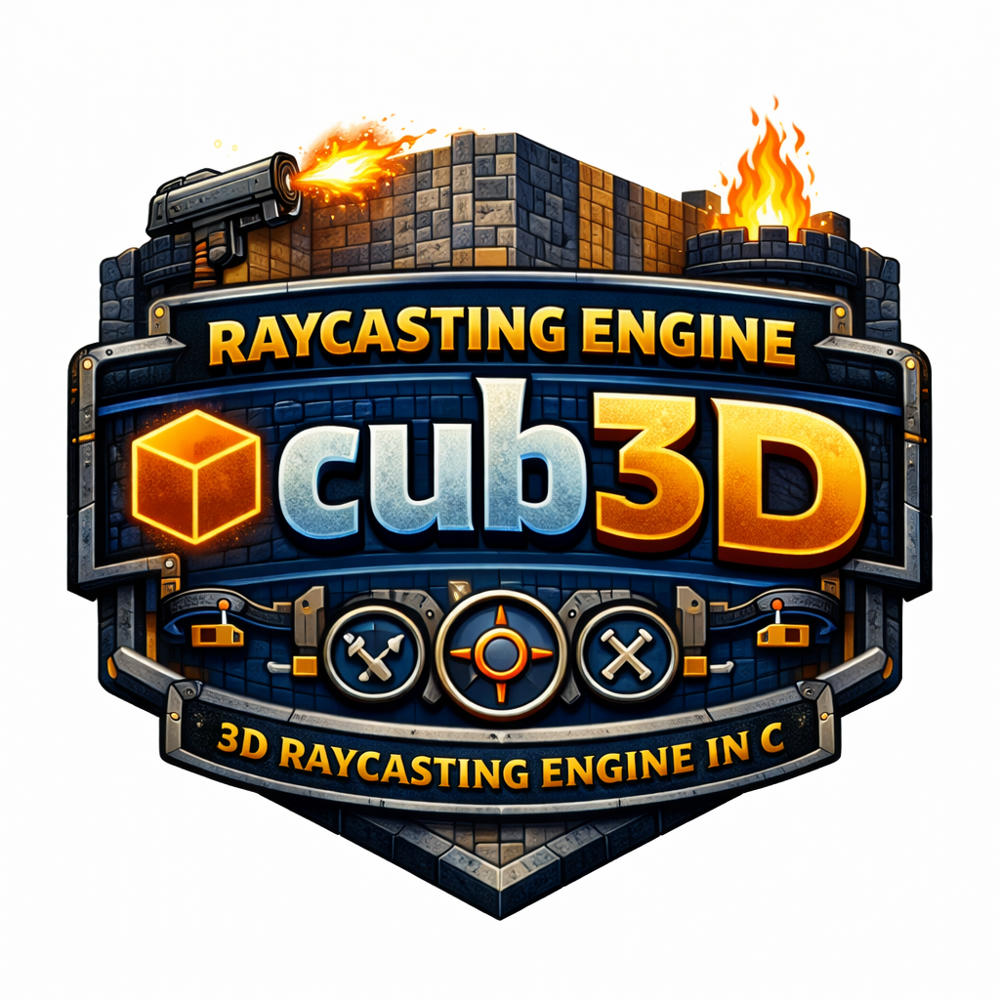
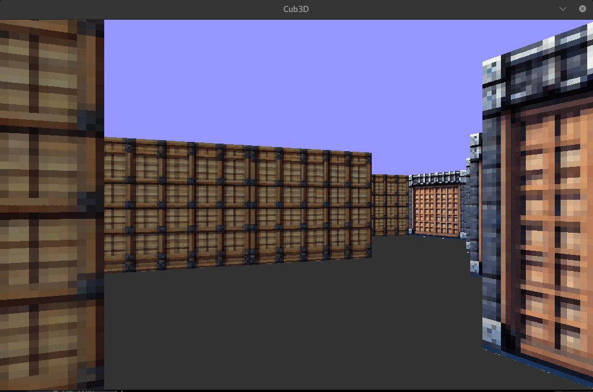

# Raycasting Engine - cub3D

<p align="center">
  
</p>

## Overview
`cub3D` is a small 3D game engine inspired by classic Wolfenstein-style rendering. It parses a `.cub` map/config file, validates it, loads textures, and renders a first-person scene using a raycasting pipeline.

This repository includes:
- a `basic` version (mandatory features)
- a `bonus` version (minimap, doors, coin system, mouse support, extra rendering features)

<p align="center">
  
</p>

## Core Concepts Covered
- 2D grid map parsing and validation
- raycasting (DDA stepping, wall distance projection, texture mapping)
- event handling (keyboard/mouse)
- frame rendering and pixel buffer management with MiniLibX
- memory/resource lifecycle management in C
- modular game loop design (`init -> parse -> render -> input -> cleanup`)

## Project Structure
- `basic/`: mandatory implementation
- `bonus/`: extended implementation
- `maps/`: valid/invalid test maps and bonus maps
- `textures/`: wall/door/coin textures
- `libft/`: custom C utility library
- `mlx/`: MiniLibX library source

## Build
From the project folder:

```bash
make
```

Build bonus target:

```bash
make bonus
```

Clean artifacts:

```bash
make clean
make fclean
```

## Run
Run mandatory build:

```bash
./cub3D maps/valid/+ve_1.cub
```

Run bonus build:

```bash
./cub3D_bonus maps/Bonus_map1.cub
```

## Controls
- W: move forward
- S: move backward
- A: strafe left
- D: strafe right
- left arrow: rotate left
- right arrow: rotate right
- mouse: rotate by moving the mouse (bonus only)
- `ESC`: exit

## Notes
- This project targets Linux/X11 MiniLibX (`-lX11 -lXext`).
- If your system is missing dependencies, install X11 and BSD compatibility dev packages first.
